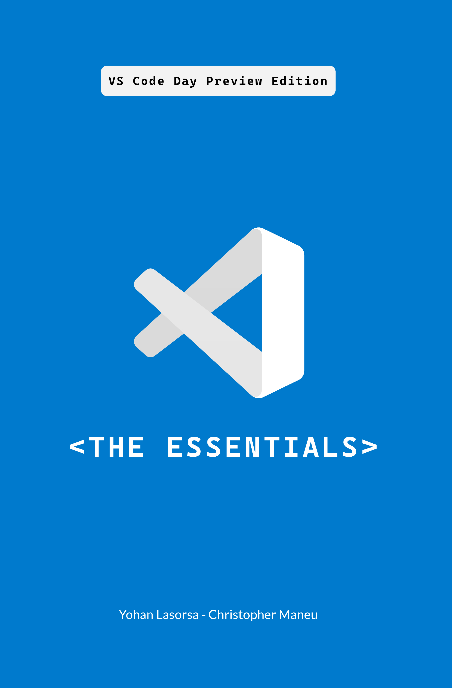

# 📚 Visual Studio Code - The Essentials

:star: If you like this book, star it on GitHub — it helps a lot!

*Visual Studio Code - The Essentials* is a comprehensive guide that explores the capabilities of [Visual Studio Code](https://code.visualstudio.com/), aiming to help both beginners and experienced developers harness its full potential. The book covers essential and advanced features, customization, extensions, and even guides on creating your own extension, all available in digital and print formats.

> [!Note]
> This ebook is currently a public preview. We are actively working on improving the content and adding more chapters. All localization efforts will start once the English version is complete.

## Get the book

| Format | Link |
|-|-|
| Website | [Read online](https://microsoft.github.io/vscode-essentials/en/) | 
| Amazon Kindle | <a href="https://aka.ms/vscode-essentials-book/kindle"><picture><source media="(prefers-color-scheme: dark)" srcset="./images/badge-amazon-rev.png"></picture></a> |
| Apple Books | <a href="https://aka.ms/vscode-essentials-book/apple"><picture><source media="(prefers-color-scheme: dark)" srcset="./images/badge-apple-books-rev.png"></picture></a> |
| Google Play Books | <a href="https://aka.ms/vscode-essentials-book/googleplay"><picture><source media="(prefers-color-scheme: dark)" srcset="./images/badge-google-play-rev.png"></picture></a> |

## Trademarks

This project may contain trademarks or logos for projects, products, or services. Authorized use of Microsoft
trademarks or logos is subject to and must follow
[Microsoft's Trademark & Brand Guidelines](https://www.microsoft.com/en-us/legal/intellectualproperty/trademarks/usage/general).
Use of Microsoft trademarks or logos in modified versions of this project must not cause confusion or imply Microsoft sponsorship.
Any use of third-party trademarks or logos are subject to those third-party's policies.
