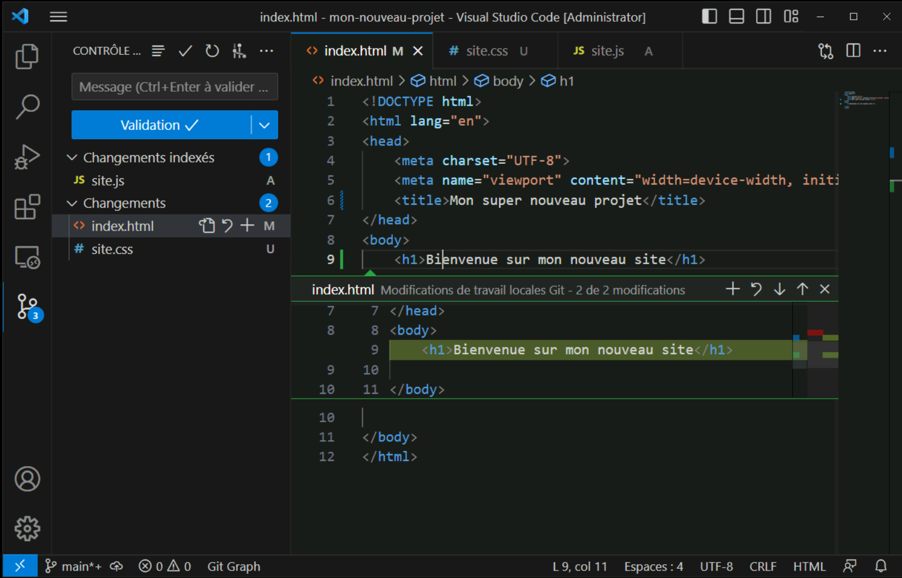
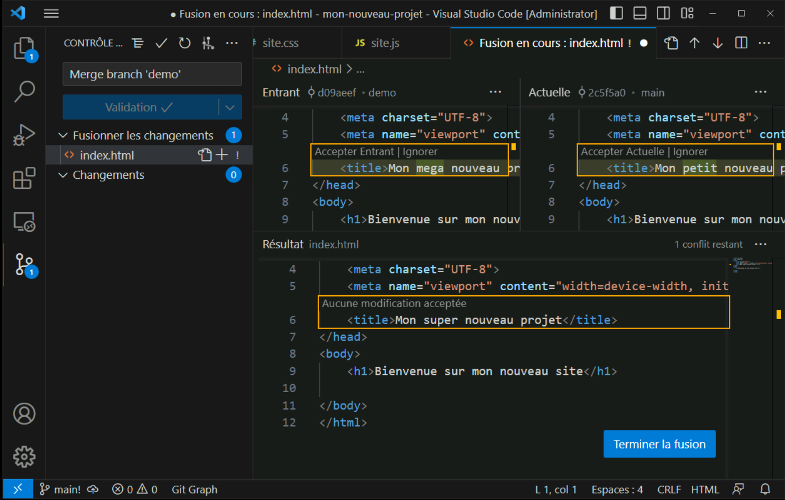
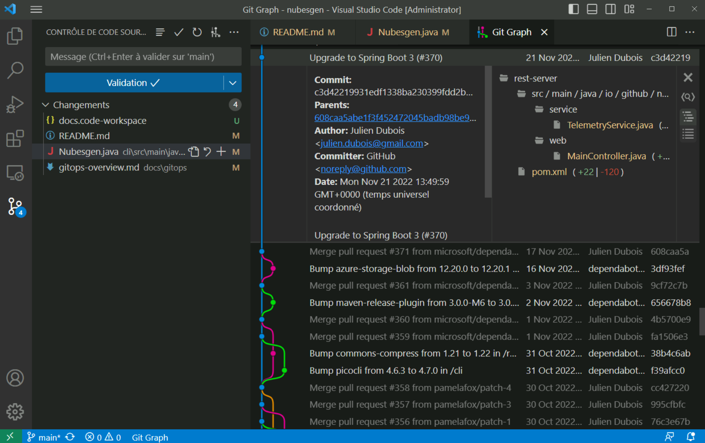

## Use Git in VS Code

If you're working in a team or on your own project, chances are you use _git_ to manage your source code. Git is the de-facto standard for source code control management. VS Code makes it easy to work with Git. In this part, we'll look at the main features you'll need every day.

> For this section, we assume you already know the basics of Git (what is a repository, a clone, a commit). If you're new to Git, we recommend following these free online modules https://learn.microsoft.com/training/paths/intro-to-vc-git/.

### Initialize or clone a repository

To work with Git, you need to be in a directory that is already a git repository. If you already have such a directory on your machine - for example, because you cloned it via the command line or another tool - you just need to open the directory with VS Code.

Do you have a folder containing your code, but it's not yet a git repository? You can simply create a repository by opening this directory, then clicking the **Initialize Repository** button in the _Source Control_ sidebar.

If you already have a remote repository, for example on GitHub, you can simply clone it using the `Git: Clone` command.

### Commit, push & pull

You have now opened a git repository in VS Code. Once your work is done, it's time to commit. The _Source Control_ sidebar allows you to view the files being edited and their status relative to git: are they tracked? Are they staged for the next commit?

The tracking status appears to the right of the file name: M for _modified_, D for _deleted_, U for _untracked_, A for _added_. Files are grouped under two sections: _Changes_ for modified but unstaged files, and _Staged Changes_ for files that will be included in the commit.

Committing changes in Git requires adding a descriptive message that explains the nature of each change. You can add it in the _Message_ field at the top of the sidebar. Once your message is added, click **Commit**, and there you go! Your changes are now stored in a commit.

To share this commit with your colleagues, you need to push it to your remote repository. The _push_ command is accessible from several places: in the status bar, to the right of the current branch name, in the command palette `Git: push`, or in the context menu of the sidebar, accessible on the **...** icon at the top right.

Retrieving remote commits is also simple using the `Pull (pull)` command, accessible in the same places as the push command.

VS Code will also offer you a `Synchronize changes` command that will perform these two commands sequentially.

### Branches and tags

You can easily manage branches and tags from VS Code. First via the status bar, the current branch is displayed at all times. Simply click on it to explore the list of branches, remote and local, and switch to another branch.

When you're about to make a release of your project, it's common to use tags to "mark" this moment in time, or more precisely the commit corresponding to this delivery. The simplest way to create a _tag_ is to execute the `Git: Create tag` command in the palette. Don't forget to push your changes to the remote repository so that the tags are accessible to the whole team.

### Managing conflicts

Doing a _push_ or a _pull_ is usually easy... Until a conflict appears! In these cases, you'll always have work to do, but VS Code will be there to help!

When an operation results in a conflict, VS Code will group the conflicting files in the **Merge Changes** section. You will then have an overview of the conflicts. By opening the merge editor (via the **Resolve in Merge Editor** button at the bottom right of the editor).

Once the conflict is resolved, you can simply commit the commit.

<!-- > -->
### Status & gutter indicators

- Commit to push
- Line diff & commit
-->
<!-- Add a table comparing the icons in the status bar -->

### Understanding the history

We have just seen the main steps of using Git in VS Code. There remains an essential tool: exploring the Git history.

You can explore the history of any file with the **Open Timeline** option in the file explorer's context menu. The timeline then opens at the bottom of the file explorer panel. A double click on a commit will open the diff corresponding to the selected file.

If you want to go further, I recommend the **Git Graph** extension. Once installed, you can display the commit and branch graph via the `Git Graph: View git graph` command. You will then have access to a visual representation of your commit history, as well as the list of tags.

For more advanced uses, this extension also allows you to do a _checkout_ or a _cherry-pick_ of particular commits.

> **Tip**: You can access the git command line from the integrated editor. Moreover, the _git_ output panel allows you to see the git commands executed for you by VS Code.
