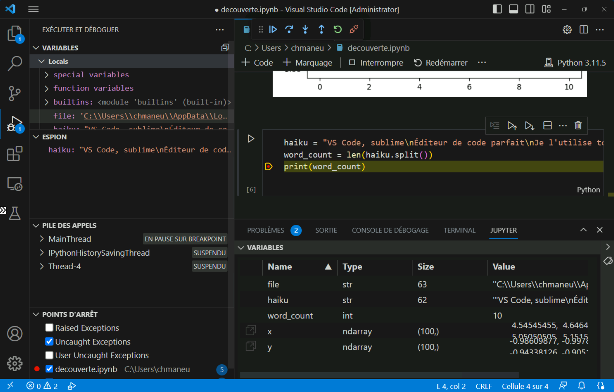

## Notebooks in VS Code

We've seen how VS Code can be used for many purposes beyond coding. Let's now look at how to use VS Code to create notebooks. Notebooks are a way of writing code in cells that can be executed independently of each other, or obviously together. It is also possible to mix code cells and documentation cells with markdown. It's a tool that has become widespread in recent years among data scientists and data engineers. We will see that it can also be useful in many other fields.

### Jupyter notebooks

The most widespread notebooks are undoubtedly **Jupyter notebooks**. They are intended to run primarily python code, although it is possible to run other languages through [_kernels_](https://github.com/jupyter/jupyter/wiki/Jupyter-kernels).

To start, you first need to install the [**Jupyter**](https://marketplace.visualstudio.com/items?itemName&#x3D;ms-toolsai.jupyter) extension. This will allow you to create, view, and run Jupyter notebooks. Viewing works even in the web version of VS Code, and running in GitHub Codespaces.

Jupyter notebooks need to be connected to a _kernel_, an execution engine, in order to run the code contained in the cells. Therefore, it will be necessary to install Python and the Python kernel. This kernel is installed simply using [**pip**](https://pypi.org/project/jupyter/), the Python package manager, via the command `pip install jupyter`. Python can be installed directly via the Microsoft Store if you are on Windows, or via various means on other operating systems. [**Anaconda**](https://www.anaconda.com/products/individual) is a distribution that is often used for its simplicity.

To create a notebook, simply use the command palette `Jupyter: New Jupyter notebook`. You can then easily add new code or documentation type cells (called _Markdown_), and of course execute the cells either via the keyboard shortcut `Ctrl+Enter`, or via the **Run cell** icon  located at the top left of the cell.


Speaking of "code execution" means "debugging". Jupyter notebooks assist you in various ways in debugging your code. First off, the _Variables_ window of the _Jupyter_ tab allows you to view all the variables declared in your different cells. You can also execute the code of a cell line by line with the command `Jupyter: Run Line by Line` (`F10`). Finally, you can debug your code by adding breakpoints in your cells, and run the code in debug mode with the command `Jupyter: Debug Cell` (`Ctrl+Shift+Alt+Enter`). You will then find everything you can expect from a classic debug mode: variable viewing, step by step execution, breakpoints, etc.



If VS Code is capable of using locally installed kernels, for some scenarios - especially in data science - you may need to share a more powerful server among multiple users. This is possible with **JupyterHub** (https://jupyter.org/hub). You can install [JupyterHub](https://tljh.jupyter.org/en/latest/index.html) simply on a Linux server, and the [**JupyterHub**](https://marketplace.visualstudio.com/items?itemName&#x3D;ms-toolsai.jupyter-hub) extension to run your notebooks on this server.

### Polyglot notebooks

Jupyter notebooks are a fantastic tool for many scenarios. However, they have one flaw: the entirety of a notebook's code must be written in the same programming language.

This is where [**Polyglot notebooks**](https://marketplace.visualstudio.com/items?itemName&#x3D;ms-dotnettools.dotnet-interactive-vscode) come into play. This type of notebook allows for code in different programming languages to be executed within the same notebook. The polyglot notebooks support the following languages: C#, F#, Javascript, PowerShell, SQL, KQL, HTML, Mermaid, R, and obviously Python.

Its use is very simple: just install the [**Polyglot notebooks**](https://marketplace.visualstudio.com/items?itemName&#x3D;ms-dotnettools.dotnet-interactive-vscode) extension, along with the **.NET SDK**. Once installed, you will find the features of Jupyter notebooks with two major differences.

Firstly, you can change the language of each of the cells via the language selector located at the bottom right of each of the cells. This is the purpose of Polyglot notebooks. But their best-kept secret is not there: you can **share data between different languages**! For example, you can use C# to query a web API, use the result to construct a SQL query, and pass the query result table to JavaScript to visualize the result.

<!-- Magic commands,
https://github.com/dotnet/interactive/blob/main/docs/magic-commands.md
 -->

Polyglot notebooks may seem a bit "gadgety" at first glance. Yet, there are many scenarios in which they can be useful. For instance, I use them very frequently to test a new library or experiment with a piece of code. With SQL support, they have become my go-to for creating data generation scripts for my development databases. And with the support for KQL (a data querying language used especially by Azure Monitor) and PowerShell, I use them more and more to write notebooks for either having operational procedures for production systems, or for small administrative tasks that are not yet integrated into a process.

If you are a .NET developer, there are many other secrets to discover, such as the automatic generation of an Entity Framework context from a database connection string or the [import of existing C# files](https://github.com/dotnet/interactive/blob/main/docs/import-magic-command.md) into your notebook.

<!-- Input prompts https://github.com/dotnet/interactive/blob/main/docs/input-prompts.md -->
<!-- Run Notebooks in command line https://github.com/jonsequitur/dotnet-repl#-run-a-notebook-script-or-code-file-and-then-exit -->

### GitHub Issues Notebooks

Because there's more to life than code, there's the [**GitHub Issues Notebooks**](https://marketplace.visualstudio.com/items?itemName&#x3D;ms-vscode.vscode-github-issue-notebooks) extension. As its name suggests, this extension allows you to write GitHub Issues (and _pull request_) queries as notebooks. You just need to install the eponymous extension in VS Code or on `vscode.dev` to start writing your queries. The syntax is identical to that used on the GitHub website with one exception: you can create variables. In the example below, it's the repository name that is made into a variable, but it could be a label or a milestone.

```
$repo=repo:jhipster/generator-jhipster
$repo label:"$$ bug-bounty $$" is:open label:"theme: reactive ⚛️"
```

GitHub Issues notebooks can be useful for sharing queries among team members, or for creating a set of queries across different repositories if you work in a multi-repo setup, for example.

