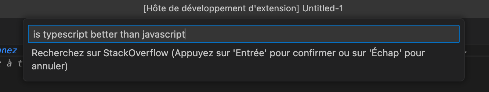

## Create Your First Extension

Now that you have mastered VS Code, to further customize it you can code your extension. If you feel a feature is missing, or if you simply want to learn more about the internal workings of VS Code, it's possible to create your own extension and publish it on the marketplace for everyone to benefit.

VS Code itself is written in _TypeScript_, and uses the Electron framework which is based on _Node.js_ and Chromium. Thus, you need Node.js to develop your extension. After installing Node.js on your machine, you then need to install the VS Code extension generator:

```bash
npm install -g yo generator-code
```

Create a new extension project by typing `yo code` in a terminal. You then have the choice to create different types of extensions:


For this example, we will create an extension that adds a command to the command palette. Choose the first option, then fill in the requested fields as follows:


Then open the generated project in VS Code, and open the file `package.json`. This file contains information about your extension, like its name, version, description, etc. It's also here that we define what our extension will add to VS Code, via the `contributes` property. In our case, we will add a command to perform a search directly on the Stack Overflow site. Modify the existing `contributes` property as follows:

```
"contributes": {
  "commands": [
    {
      "command": "vscode-overflow.search",
      "title": "Search on Stack Overflow"
    }
  ]
},
```

We have defined a new command here, which will be accessible via the command palette. We will now define what this command will do. For this, open the file `src/extension.ts`. This file contains the code of your extension. You can see that the code generated by the extension generator is already functional and contains comments to help understand what is happening here. We will now add our code to perform a search on Stack Overflow. Replace these lines:

```typescript
let disposable = vscode.commands.registerCommand('vscode-overflow.helloWorld', () => {
  // The code you place here will be executed every time your command is executed
  // Display a message box to the user
  vscode.window.showInformationMessage('Hello World from vscode-overflow!');
});
```

With the following code:

```typescript
let disposable = vscode.commands.registerCommand('vscode-overflow.search', async () => {
  // Retrieve the selected text
  let query = vscode.window.activeTextEditor?.document.getText(vscode.window.activeTextEditor.selection);

  if (!query) {
    // Ask the user to enter a question
    query = await vscode.window.showInputBox({
      placeHolder: 'question',
      prompt: 'Search on StackOverflow'
    });
  }

  const uri = vscode.Uri.parse(`https://stackoverflow.com/search?q=${query}`);

  // Open the browser with the search
  await vscode.commands.executeCommand('vscode.open', uri);
});
```

Now, press `F5` to test your extension. A new VS Code window will open, with your extension installed. You can now test it by opening the command palette and selecting `Search on Stack Overflow`, enter a question and press `Enter`. A new browser window will open with the search results. You can also select text in the editor and launch the command, the selected text will be used as the question.



> **Note**: For security reasons, VS Code asks you to confirm opening when it does not recognize the domain of a website, as is the case here. You can disable this confirmation request by adding the domain to the trusted sites list by choosing the `Configure Trusted Domains` option in the confirmation window.

Congratulations, you have created your first extension for VS Code! Of course, it's possible to do much more with extensions, such as adding menus, toolbars, snippets, etc. You can find complete documentation as well as guides and examples at https://code.visualstudio.com/api.
