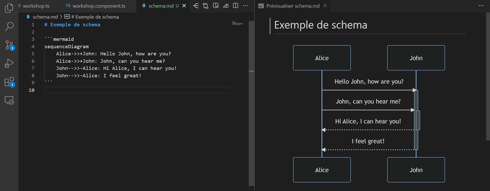

## Aller plus loin que l'édition de code

VS Code dispose d'un support intégré de _Markdown_, qui permet de formatter des documents à base d'une syntaxe texte facile à lire et à écrire. Au delà de la coloration syntaxique et de la prévisualisation (accessible via `Maj+Ctrl+V` ou `Maj+Cmd+V` sur Mac), le support de ce langage permet bien plus que la simple mise en forme de documents.

### Documentation et schémas

Markdown est un langage de choix pour la documentation de vos projets, mais qu'en est-il si vous avez besoin de créer des diagrammes et schémas pour mieux expliquer votre code ?
Pas de soucis, il y existe plein d'extensions pour cela !

Pour tout ce qui est diagrammes, qu'ils soient de flux, de séquence, de classe, de Gantt et bien d'autres encore, l'extension **Markdown Preview Mermaid Support** est faite pour vous. Celle-ci vous permettra d'utiliser la syntaxe de _Mermaid_ (https://mermaid.js.org) pour inclure et visualiser vos diagrammes directement dans vos documents Markdown. Vos diagrammes sont définis à l'aide d'une syntaxe textuelles dans des blocs de code classiques, et seront affichés dans la prévisualisation de Markdown.

Si vous préférez utiliser un outil de dessin, l'extension **Draw.io Integration** vous permettra d'embarquer l'éditeur en ligne du même nom dans VS Code. Vous pourrez alors créer et éditer vos schémas directement, sans quitter VS Code. Même exportés en SVG ou PNG, vos schémas resteront éditables en gardant l'extension de fichier `.drawio.png` ou `.drawio.svg` si vous activez l'option, pratique!

Une autre alternative si vous aimez bien les dessins sur tableau blanc, c'est l'extension **Excalidraw**, qui vous permettra de créer des dessins vectoriels directement dans VS Code, en gardant un aspect "dessiné à la main" qui peut être très sympa pour des schémas.

### Organisation et notes

En plus de la documentation, Markdown est aussi très utile pour prendre des notes et s'organiser. L'extension **Dendron** permet d'organiser ses notes en base de connaissance hierarchique, et de les lier à des fichiers de votre projet. L'outil est également bien intégré à la recherche globale de VS Code, et tire parti de la _navigation rapide_ pour vous permettre de naviguer entre toutes vos notes. Vous pouvez même exporter votre base de connaissance en site web, pour la partager avec vos collègues.

Quand il s'agit d'organiser son quotidien, que ce soit pour le travail ou pour la vie personnelle, l'extension **Todo Tree** est un outil très pratique. Elle permet de lister les `TODO` et `FIXME` de tous vos fichiers, et de les afficher dans une vue dédiée, avec des filtres et des options de tri. Fini les `// TODO: fix this` qui s'accumulent et trainent dans vos fichiers, cette extension vous permettra de les retrouver facilement et de les traiter.

Et si, comme moi, vous aimez organiser vos idées sous forme de mindmaps, l'extension **Markmap** vous permet de créer des mindmaps simplement avec des listes Markdown, et de naviguer dans celles-ci directement dans VS Code.

### Présentations

On peut tout faire ou presque avec Markdown, y compris des présentations ! L'extension **Marp for VS Code** permet de créer des présentations complètes en Markdown, et de les exporter en PDF, HTML ou PowerPoint. L'extension est basée sur l'outil _Marp_ (https://marp.app/), qui inclus également plusieurs thèmes de base et la possibilité de créer le votre en CSS.

Quelques lignes de markdown suffisent pour créer une présentation, et l'extension fera le reste.

Vous l'aurez compris, j'aime beaucoup Markdown, et sa simplicité et sa flexibilité en font un outil très pratique pour accompagner le développement de vos projets. Limiter le nombre d'allers-retours entre VS Code et d'autres outils est un gain de temps et de productivité souvent non négligeable, n'hésitez donc pas à essayer ces extensions pour voir si elles peuvent vous aider dans vos projets.
