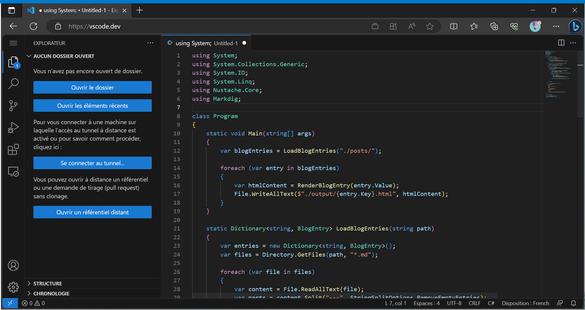
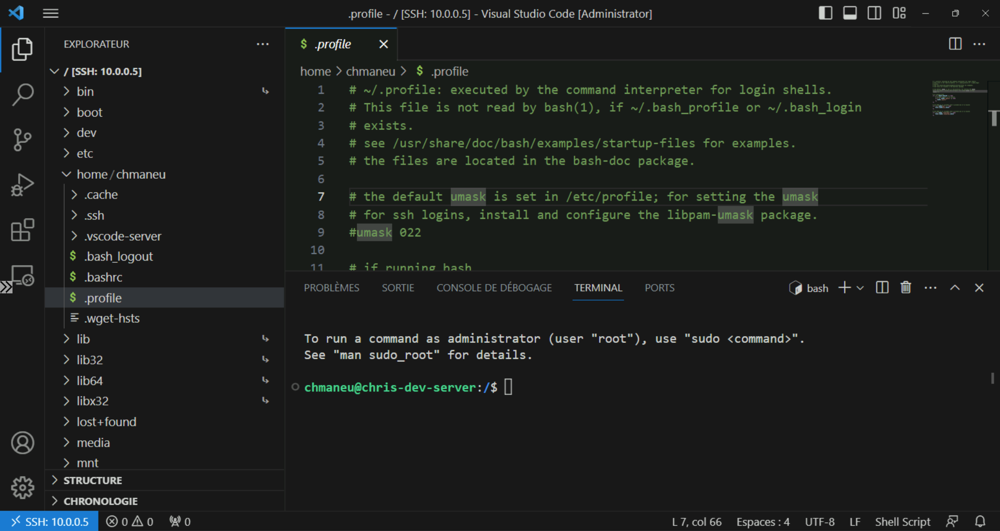
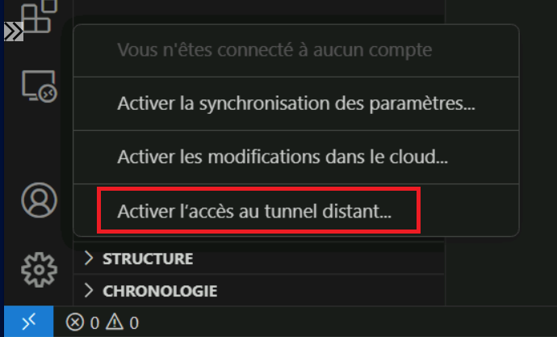

## Démarrer avec VS Code

Visual Studio Code, disponible sur macOS, Linux et Windows, est votre nouveau compagnon de route. Que vous éditiez du texte, écriviez du code ou manipuliez des données, il saura vous accompagner à chaque instant. En quelques minutes - ou même moins - vous serez prêt à coder. Explorons ensemble les différentes options qui s'offrent à vous.

### Installer VS Code en quelques clics

La plupart du temps, vous installerez VS Code sur votre poste de travail principal. La méthode la plus simple est d'utiliser le gestionnaire de paquets intégré à votre système d'exploitation, voire le magasin d'applications.

**Windows**, vous pouvez installer VS Code directement depuis le Microsoft Store [aka.ms/vscode-msstore](https://aka.ms/vscode-msstore) et ce en un clic. Vous êtes plutôt ligne de commande ? Vous pouvez utiliser **WinGet**, le package manager de Windows. Il suffit d'exécuter la commande suivante dans le terminal :

```powershell
winget install Microsoft.VisualStudioCode
```

> **Astuce**: WinGet est disponible par défaut dans certaines versions de Windows 11. Vous pouvez en apprendre plus sur WinGet dans la documentation officielle: https://learn.microsoft.com/windows/package-manager/winget/

**Linux**, vous pouvez installer VS Code depuis un package. Vous trouverez tous les formats de package (Debian, RPM, etc.) pour vos besoins sur la page de téléchargement [code.visualstudio.com](https://code.visualstudio.com). L'exemple suivant montre comment installer la version x64 sur un OS Debian ou Ubuntu.

```bash
wget -O vscode.deb https://code.visualstudio.com/sha/download?build=stable&os=linux-deb-x64
sudo apt install ./vscode.deb
```

> **En savoir plus**: VS Code est également disponible sur **Snaps**, Le store d'applications pour Linux. Si vous ne connaissez pas Snaps, vous pouvez en découvrir plus sur le site officiel : https://snapcraft.io/docs/installing-snapd.

**Mac**: Vous pouvez télécharger l'application depuis le site officiel. Il vous suffit alors de glisser-déposer l'application dans le dossier **Applications** de votre Mac.

### Une utilisation nomade

Vous souvenez-vous des "portable apps" ? Ces applications exécutées depuis une clé USB, sans installation ? Même si cette tendance a décliné, vous pouvez toujours être le super-héros du code sans être l'administrateur de votre poste. Il suffit de télécharger la version "zip" (ou "tar.gz") de VS Code. Vous pouvez ensuite simplement exécuter `code.exe` (ou son équivalent en fonction de votre système d'exploitation) pour travailler avec VS Code.

Si vous utilisez cette version de manière régulière, vous voudrez peut-être conserver vos paramètres entre différentes sessions. Dans ce cas, il vous faudra créer un dossier `data` (ou `code-portable-data`) au même niveau que l'exécutable VS Code. 

> **En savoir plus**: Vous trouverez plus d'informations sur la version portable de VS Code sur le site officiel : https://code.visualstudio.com/docs/editor/portable

### Utiliser VS Code sans l'installer

Vous êtes chez un-e ami-e et avez besoin de coder rapidement ? L'horreur, il n'y a que le bloc-notes sur son ordinateur ! Heureusement, VS Code vient à votre secours.

Rendez-vous simplement sur le site [vscode.dev](https://vscode.dev) et vous êtes prêt à coder, sans rien installer !



Cette version de VS Code, tournant directement dans votre navigateur, peut faire des merveilles. Elle peut ouvrir un fichier de votre ordinateur, après votre autorisation bien sûr, ou accéder à un dépôt Git.

> **Le saviez-vous ?** Si vous utilisez GitHub, vous pouvez utiliser l'éditeur "github.dev". Il suffit pour cela d'appuyer sur la touche `.` sur n'importe quel dépôt GitHub pour lancer l'éditeur. Vous pouvez également vous rendre sur [github.dev](https://github.dev) 

Quelques limitations existent sur cette version web. Par exemple, le terminal intégré ou la compilation de code sont absents. Certaines extensions - telles que Live Share - sont fonctionnelles, d'autres non. 

### VS Code sur vos serveurs

Besoin d'accéder à un serveur distant ? Pas d'accès "Bureau à distance" ? Pas de problème, VS Code a deux super solutions pour vous : SSH et VS Code Server.

L'extension "Remote - SSH" vous permet de vous connecter à un serveur distant via SSH et utiliser VS Code comme si vous étiez connecté directement. Vous aurez accès au terminal et au système de fichiers distant. Nous verrons plus en détail comment installer des extensions dans une prochaine section.



Il existe cependant des scénarios pour lesquels vous n'avez pas un accès direct à SSH: poste derrière un pare-feu, poste Windows, etc... Il vous est alors possible d'utiliser **VS Code Server**. Ce mode de VS Code vous permet de créer un tunnel sécurisé entre votre poste et le poste distant. La connexion entre les deux machines est sécurisée via votre compte GitHub. Vous ne pouvez donc pas vous servir de cet outil pour partager votre machine à quelqu'un d'autre.

> **Important**: Bien que VS Code Server n'expose pas directement votre serveur sur Internet, cela crée un point d'entrée sur vos machines. Avant de l'utiliser sur ces postes tels que des serveurs de production, assurez-vous de bien comprendre les implications sur votre _modèle de menace_ (Threat Model).

Pour commencer, installez **VS Code CLI** sur le poste cible, lancez la commande magique `code tunnel`, et identifiez-vous avec GitHub. Si vous êtes sur un poste avec une interface visuelle (comme votre PC fixe), activez le tunnel via le **menu de comptes**.



Une fois le tunnel activé, vous pouvez accéder à votre poste cible simplement depuis vscode.dev. Vous pouvez également y accéder depuis un autre poste en utilisant l'extension "Remote - Tunnels".

### Mettre à jour VS Code

Par défault, Visual Studio Code vous suggère automatiquement d'installer les mises à jour dès leur disponibilité. Vous pouvez alors choisir de l'installer immédiatement ou lors de la prochaine fermeture de l'éditeur. À moins que vous ne travailliez avec une version portable ou que vous ayez opté pour désactiver cette fonction, la mise à jour de VS Code est un jeu d'enfant.

Maintenant, parlons cadence ! Les équipes dédiées à VS Code dévoilent une version mineure chaque mois. Pour profiter pleinement de ce que VS Code a à offrir, pensez à suivre ce rythme mensuel. Certains mois peuvent avoir plus d'une version mineure, notamment lorsqu'il y a une faille de sécurité ou une régression. C'est pour cela qu'il est vivement conseillé d'activer la mise à jour automatique.

### Etre en avance avec l'Insider edition

Pour les plus audacieux, avides de nouveautés, vous pouvez utiliser l'édition "Insider" de VS Code. Cette version est mise à jour quotidiennement et vous permet d'avoir accès aux dernières fonctionnalités avant tout le monde. Bien sûr, c'est comme jouer avec un prototype - cela peut être un peu risqué pour une utilisation en production. Mais ne vous inquiétez pas, vous pouvez avoir cette version et la version stable côte-à-côte sur votre ordinateur.

Vous pouvez télécharger la version insiders sur https://code.visualstudio.com/insiders/, et même accéder à la version web sur https://insiders.vscode.dev/.
