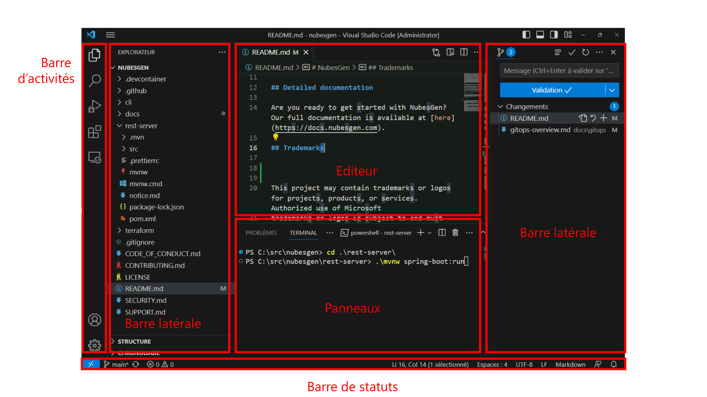

## Fonctionnement de base

<!-- 
ref: https://code.visualstudio.com/docs/getstarted/userinterface

-->

Nous allons maintenant voir les bases du fonctionnement et de l'interface de Visual Studio Code. 

### Une vue d'ensemble de l'interface

Lorsque vous ouvrez VS Code pour la première fois, voici les éléments clés de l'interface que vous verrez :

1. **Barre d'activités** : Située sur le côté extrême gauche, elle contient des icônes pour les différentes vues principales, telles que le navigateur de fichiers, la recherche, la gestion des extensions et la vue de débogage. Les icônes présents dans votre installation peuvent évoluer en fonction des extensions que vous installez.

2. **Barre latérale** : Juste à droite de la barre d'activités, elle affiche les vues de l'une des icônes d'activité sélectionnées, par exemple le navigateur de fichiers. Cette barre latérale peut contenir des informations intéressantes en fonction des extensions utilisées - nous en verrons un exemple plus tard avec Git. Sur l'image précédente, vous verrez également une barre latérale sur la droite de la fenêtre. Ce n'est pas le placement par défaut, mais vous avez la possibilité de glisser une barre d'activité de la gauche vers la droite. Dans mon cas, je place la fenêtre Git sur la droite. Ainsi, VS code suit mon processus de développement : je sélectionne un fichier à gauche, que j'édite au milieu, puis que je _commit_ à droite.

3. **Zone d'édition** : C'est le coeur de VS Code. C'est ici que les fichiers s'ouvriront pour être édités. Nous détaillons cette zone un peu plus tard.

4. **Barre d'état** : Située en bas, elle affiche des informations sur le fichier ouvert et l'état actuel de l'éditeur: quel langage est utilisé, où est placé le curseur, sur quelle branche vous êtes actuellement, est-ce que vous travaillez dans un conteneur ou non, etc.

5. **Les panneaux** : Situés en bas de l'éditeur, ils contiennent différents outils pour vous aider dans vos tâches. On retrouve par exemple un terminal intégré, une console de débogage ou la sortie d'outils - tels que le compilateur. Certaines extensions peuvent également rajouter des panneaux pour vous simplifier la vie.

### Quoi ouvrir ?

Vous pouvez lancer VS Code sans ouvrir quoi que ce soit, mais il vous faudra bien ouvrir quelque chose pour commencer à travailler. 

L'usage le plus courant est très certainement d'**ouvrir un dossier**. Vous pourrez ainsi accéder à l'arborescence de fichiers depuis la barre latérale. Vous pouvez également ouvrir ou créer un nouveau fichier. 

> **Astuce**: Vous pouvez ouvrir un fichier ou un dossier dans VS Code depuis un terminal simplement en utilisant la commande `code monficher.txt`.

VS Code vous permet également d'ouvrir directement un dépôt Git - en le clonant localement -, de vous connecter à un serveur distant soit via SSH soit via VS Code "Tunnels".

Si vous travaillez sur un projet dont le code se situe dans plusieurs dossiers, vous pouvez créer un **Espace de travail**. Cela vous permet de créer une arborescence "virtuelle" que vous pouvez ouvrir simplement avec VS Code.

### La palette de commandes

La palette de commandes est un outil très puissant dans VS Code. Elle vous permet d'accéder à de nombreuses fonctionnalités et commandes directement avec le clavier.

Pour ouvrir la palette de commandes, vous pouvez utiliser le raccourci clavier `Ctrl + Shift + P` (ou `Cmd + Shift + P` sur Mac). Une fois ouverte, vous pouvez simplement commencer à taper pour rechercher une commande par son nom. Les commandes les plus utilisées apparaîtront en haut.

C'est une façon efficace de naviguer dans VS Code sans avoir à utiliser la souris, et vous découvrirez probablement des fonctionnalités que vous n'aviez pas remarquées auparavant.

> **Astuce**: Vous avez besoin de concentration ? Utilisez la commande `View: Toggle Zen Mode` pour masquer tout ce qui est superflu et vous concentrer sur votre code. Il ne vous manque plus qu'un accompagnement musical pour être dans la zone. 

### Les raccourcis clavier

Les raccourcis clavier sont essentiels pour une utilisation efficace de VS Code. Ils vous permettent de naviguer et d'éditer votre code beaucoup plus rapidement que si vous utilisiez la souris. Voici quelques raccourcis clavier utiles pour commencer :

- `Ctrl + P` (ou `Cmd + P` sur Mac) : Ouvrir un fichier rapidement par son nom.
- `Ctrl + B` : Afficher/Masquer la barre latérale.
- `Ctrl + /` : Commenter/De-commenter une ligne.
- `Ctrl + D` : Sélectionner la prochaine occurrence du mot sous le curseur.
- `Ctrl + Shift + K` : Supprimer la ligne actuelle.
- `Alt + ↑` ou `Alt + ↓` : Déplacer la ligne courante vers le haut ou vers le bas.
- `Ctrl + Space` : Activer la complétion automatique.

Il y a beaucoup d'autres raccourcis clavier disponibles, et ils peuvent vraiment accélérer votre flux de travail. Vous pouvez toujours ouvrir la liste complète des raccourcis clavier en utilisant le menu `Aide` > `Raccourcis clavier`.

### Zoom sur la fenêtre d'édition

La fenêtre d'édition regorge d'outils pour vous aider au quotidien. L'éditeur en lui-même intègre de base de nombreuses fonctionnalités: 
- **Une coloration syntaxique** avec de très nombreux langages supportés. Vous aurez peut être besoin d'installer une extension pour certains langages, ou de choisir le bon langage (à droite dans la barre de status, ou avec la commande _Changer le mode de langage_ dans la palette de commandes).
- **Les lignes d'indentation verticales** et **la coloration des accolades** pour vous aider à comprende les niveaux de hierarchie de votre code.
- **L'autocomplétion** de code.

En plus de ces fonctions, vous aurez plusieurs éléments en périphérique de votre éditeur.

Tout à droite, vous trouverez la **minimap** : une représentation visuelle de votre code. Cette _carte_ sera très utile lors que vos fichiers contiennent de nombreuses lignes. Juste au dessus, vous trouverez une zone d'**actions rapides**. L'Icône sur l'image précédente vous permet de découper votre éditeur en deux, vous permettant ainsi de travailler deux fichiers en parallèle. En fonction des langages et des extensions, vous pouvez avoir d'autres actions. Par exemple, sur les fichiers Markdown, il est possible d'avoir une prévisualisation du fichier.

La zone d'éditeur contient également d'autres éléments pour vous aider à naviguer dans votre code. Tout en haut de l'éditeur, vous trouverez un navigateur vous permettant de comprendre où se situe le fichier courant dans l'arborescence de votre projet. En plus des numéros de ligne, vous trouverez sur le côté gauche des **indicateurs git** qui vous permettent en un clin d'oeil de repérer les lignes de code que vous avez modifiés depuis l'ouverture du fichier.n Ces indicateurs sont également présent dans la nonomap et dans l'ascenseur situé tout à droite.
