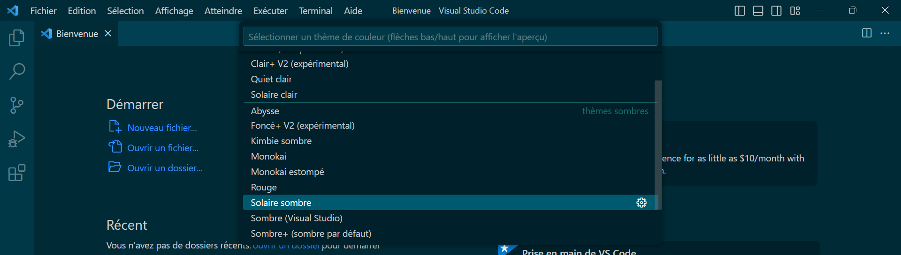
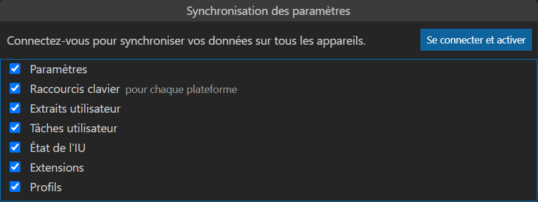
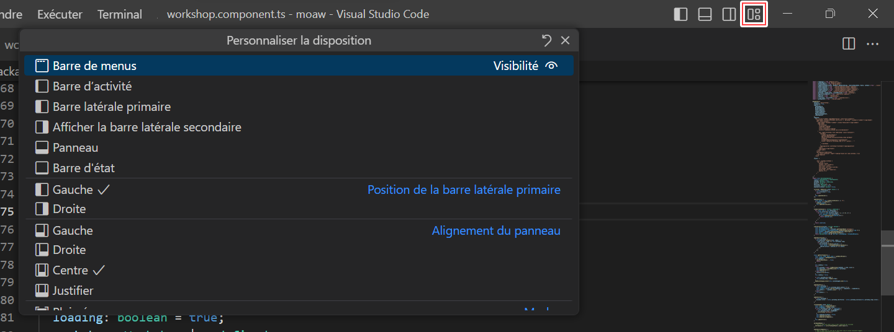
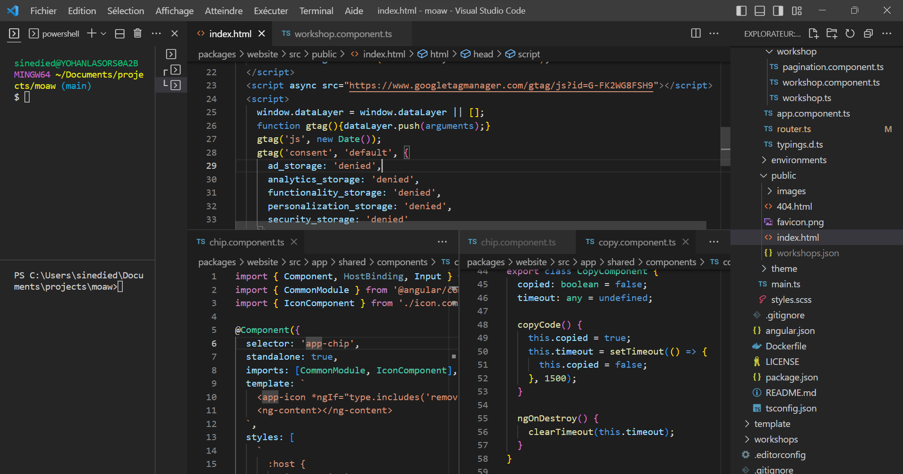

## Personnalisation de l'éditeur

L'une des forces de VS Code est sa capacité à être personnalisé et s'adapter entièrement à vos besoins. On peut ainsi modifier l'apparence de l'éditeur, ajouter des extensions, de modifier ou créer ses raccourcis clavier, et bien plus encore.

Une des premières choses que l'on fait après avoir installé VS Code est de choisir un thème. Il en existe des centaines, et vous pouvez même créer le vôtre. Si vous ouvrez la palette de commandes et cherchez l'option `Préférences: Thème de couleur`, vous pourrez en choisir un dans la liste les thèmes disponibles.

> **Astuce** : en navigant dans la liste avec les flèche haut et bas du clavier, vous pourrez voir un aperçu du thème sélectionné.



Si les thèmes proposés par défaut ne vous conviennent pas, vous pouvez également en télécharger d'autres sur la marketplace d'extensions. Sélectionnez l'icône d'extension dans la barre latérale, et entrez `@category:"themes"` dans la barre de recherche. A noter qu'un thème VS Code peut couvrir un ou plusieurs des éléments suivants, qui peuvent être choisis indépendamment :

- Couleurs de l'interface
- Icônes de fichiers
- Icônes du produit (barre latérale, barre d'outils, etc.)

Votre choix de thème est sauvegardé dans vos _Préférences utilisateur_, et s'applique par défaut à tous vos projets (aussi appelés _espaces de travail_).

```
"workbench.colorTheme": "Default Dark+"
```

Il est cependant possible de choisir un thème différent pour vos projets en créant un fichier de configuration spécifique pour l'espace de travail, comme nous allons le voir plus loin.

### Modification du thème courant

Si vous voulez changer une ou plusieurs couleurs du thème courant, vous pouvez le faire en modifiant le fichier `settings.json` de vos préférences utilisateur. Pour cela, ouvrez la palette de commandes et cherchez l'option `Préférences: Ouvrir les paramètres (JSON)`.

Les propriétés `workbench.colorCustomizations` et `editor.tokenColorCustomizations` vous permettent de modifier respectivement les couleurs de l'interface et de l'éditeur de code. Par exemple, vous pouvez changer la couleur de fond de la barre latérale avec la propriété `activityBar.background` :

```
"workbench.colorCustomizations": {
    "activityBar.background": "#223355",
}
```

L'autocomplétion (`Ctrl+Espace`) vous permettra de voir toutes les valeurs disponibles pour ces propriétés.

Il est également possible d'apporter des changements au thème courant via des extensions. Par exemple l'extension **background** du marketplace permet d'ajouter une image de fond à l'éditeur, et l'extension **Peacock** vous permet de changer la couleur de chaque nouvelle instance de VS Code pour mieux les différencier.

### Configuration des paramètres

L'ensemble des paramètres de VS Code ainsi que des extensions installées sont stockés dans un fichier JSON, le fichier `settings.json` vu précédemment. Vous pouvez y accéder en ouvrant la palette de commandes et en cherchant l'option `Préférences: Ouvrir les paramètres (JSON)`, ou les changer via l'interface graphique avec `Préférences: Ouvrir les paramètres (UI)`. Il existe deux types de paramètres :

- Les paramètres utilisateur, qui s'appliquent à tous les projets
- Les paramètres d'espace de travail, qui s'appliquent uniquement au projet courant. Ces préférences sont stockées dans un fichier `.vscode/settings.json` à la racine du projet, et peuvent être partagées avec les autres membres de l'équipe.

Il est également possible de synchronizer vos paramètres entre plusieurs machines, pour repliquer facilement votre configuration partout. Pour cela, ouvrez la palette de commandes et lancez `Synchronisation de paramètres: Activer la synchronisation des paramètres`. Vous pouvez ensuite choisir quelles données vous souhaitez de synchroniser, et vous connectez via un compte GitHub ou Microsoft pour le stockage.



Il suffit alors de suivre le même procédé sur vos autres machines pour retrouver votre configuration.

> **Astuce** : il possible d'ignorer la synchronisation de certains paramètres ou extensions avec les propriétés suivantes de votre fichier `settings.json` :
>
> ```
> "settingsSync.ignoredExtensions": [ ],
> "settingsSync.ignoredSettings": [ ]
> ```

A noter également que le dossier `.vscode` peut contenir d'autres fichiers de configuration, comme `launch.json` pour la configuration du débogueur, `tasks.json` pour la configuration des tâches, ou encore `extensions.json` pour la configuration des extensions recommandées pour le projet. Lorsqu'il est partagé avec l'équipe, ce dossier permet ainsi de standardiser la configuration de l'éditeur pour tous les développeurs.

### Raccourcis clavier

Pour être efficace quand on code, rien de tel que de savoir utiliser les raccourcis clavier. VS Code en propose des centaines, et vous pouvez modifier ceux existants ou en créer de nouveaux. Pour cela, ouvrez la palette de commandes et cherchez l'option `Préférences: Ouvrir les raccourcis clavier`. Vous verrez alors s'afficher la longue liste des raccourcis clavier déjà configurés, mais également l'ensemble des commandes de l'éditeur et des extensions installées pour lesquelles vous pouvez créer un raccourci.

De manière similaire aux paramètres utilisateur, les raccourcis claviers sont stockés dans un fichier `keybindings.json` qu'il est possible de modifier directement. Si vous êtes à l'aise avec le JSON, il est même possible d'ajouter des conditions pour que le raccourci ne soit actif que dans certains contextes, ou de configurer des macros consistant en une suite de commandes. Par exemple, ici le raccourci `Ctrl+N` crée un nouveau fichier TypeScript et insère un template de classe:

```json
{
  "key": "ctrl+n",
  "command": "runCommands",
  "args": {
    "commands": [
      {
        "command": "workbench.action.files.newUntitledFile",
        "args": {
          "languageId": "typescript"
        }
      },
      {
        "command": "editor.action.insertSnippet",
        "args": {
          "langId": "typescript",
          "snippet": "class ${1:ClassName} {\n\tconstructor() {\n\t\t$0\n\t}\n}"
        }
      }
    ]
  }
},
```

### Modification de l'interface

Au delà du thème et des couleurs, il est possible de modifier l'interface de VS Code en profondeur pour l'adapter à vos besoins. Dans la barre de titre, vous dispose de plusieurs icônes vous permettant de masquer les principaux panneaux de l'interface, mais également de personnaliser plus en détail l'interface en sélectionnant celle de droite :



L'agencement de l'interface aussi être complètement modifié en glissant-déposant les différents panneaux, et vous pouvez même créer des groupes de panneaux en les glissant-déposant les uns sur les autres. La fenêtre d'édition peut aussi être divisée horizontalement ou verticalement via les commandes `Fractionner l'éditeur` de la palette de commande, afin d'afficher plusieurs fichiers simultanément. Enfin, il est possible choisir quels éléments afficher ou masquer par un clic droit sur la plupart des éléments de l'interface, comme la barre latérale, la barre d'état, la minimap, etc. En poussant un peu, il devient même parfois difficile de reconnaître VS Code!



> **Astuce** : Si vous souhaitez vous concentrer temporairement sur votre code uniquement, et eviter toute distraction, alors le mode _zen_ est fait pour vous. Il suffit de l'activer via la palette de commande, et VS Code passera en plein écran et masquera alors tous les éléments de l'interface pour ne laisser que l'éditeur de code.

### Utilisation des profils

Si l'on travaille dans plusieurs contextes ou technologies différentes, il peut être utile de pouvoir changer rapidement de configuration, et de passer d'un ensemble d'extensions à un autre par exemple. VS Code intègre depuis peu la gestion des profils, qui permettent de sauvegarder une configuration d'extensions, de paramètres, de snippets et même de dispositions d'interface, et de les charger en un clic. VS Code sauvegarde de base toutes vos modifications dans le profil `Par défaut`, mais vous pouvez en créer d'autres pour sauvegarder des configurations différentes.

Pour créer un profil, ouvrez la palette de commandes et cherchez l'option `Profils: Créer un profil`. Vous pouvez alors choisir de créer un profil vide, de dupliquer un profil existant, ou encore utiliser l'un des modèles proposés. Une fois le profil créé, vous pourrez personnaliser toutes les options de VS Code que vous souhaitez, et celles-ci seront sauvegardées dans le profil. Pour changer de profil par la suite, ouvrez la palette de commandes et cherchez l'option `Profils: Changer de profil`.
