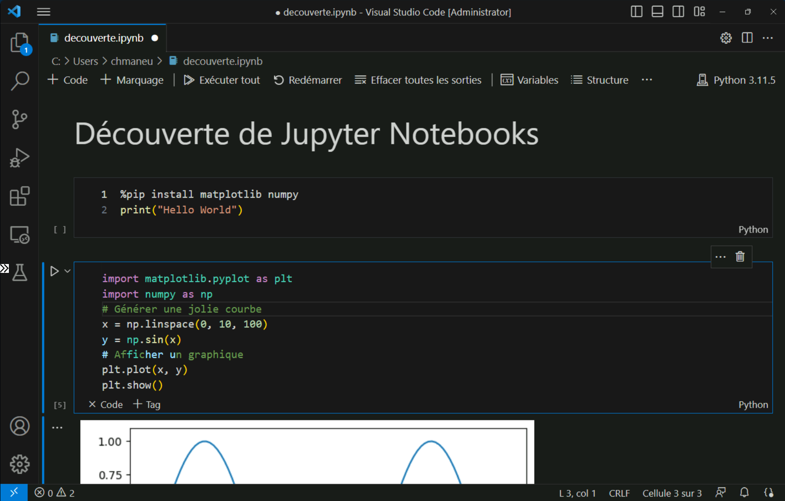
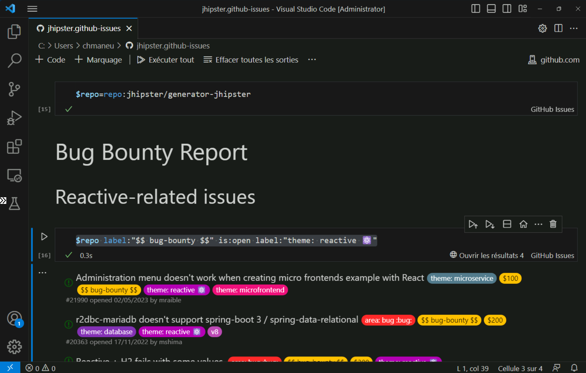

## Les notebooks dans VS Code

Nous avons vu comment VS Code pouvait être utilisé pour de nombreux usages au-delà du code. Regardons maintenant comment utiliser VS Code pour créer des notebooks. Les notebooks sont une manière d'écrire du code dans des cellules qui peuvent être exécutées indépendamment les unes des autres, ou bien évidemment ensemble. Il est également possible de méler cellules de code et cellules de documentation avec markdown. C'est un outil qui s'est répandu ces dernières années chez les data scientists et les data engineers. Nous allons voir qu'il peut également être utile dans bien d'autres domaines.

### Jupyter Notebooks

Le type de notebooks le plus répandu est sans conteste les **Jupyter notebooks**. Ils sont destinés à exécuter principalement du code python, bien qu'il soit possible d'exécuter d'autres langages via des [kernels](https://github.com/jupyter/jupyter/wiki/Jupyter-kernels).

Pour commencer, il faut tout d'abord installer l'extension  [Jupyter](https://marketplace.visualstudio.com/items?itemName=ms-toolsai.jupyter). Celle-ci vous permettra de créer, visualiser et d'exécuter des notebooks Jupyter. La visualisation fonctionne même dans la version web de VS Code, et l'exécution dans GitHub Codespaces.

Les notebooks Jupyter ont besoin d'être connectés à un _kernel_, un moteur d'exécution, afin de pouvoir exécuter le code contenu dans les cellules. Il sera donc nécessaire d'installer python et le kernel python. Ce kernel s'installe simplement à l'aide de [pip](https://pypi.org/project/jupyter/) - le package manager de python - via la commande `pip install jupyter`. L'installation de python peut se faire directement via le Microsoft store si vous êtes sous Windows, ou via différents moyens sur les autres systèmes d'exploitation. [Anaconda](https://www.anaconda.com/products/individual) est une distribution qui est souvent utilisée pour sa simplicité. 

Pour créer un notebook, il suffit d'utiliser la barre de commandes (`Ctrl+Shift+P`) et de taper `Jupyter: Nouveau Jupyter notebook`. Vous pourrez alors ajouter simplement de nouvelles cellules de type code ou de type documentation (appelées _Marquage_), et bien évidemment exécuter les cellules soit via le raccourci clavier `Ctrl+Entrée`, soit via l'icône _Exécuter la cellule_  situé en haut à gauche de la cellule.



Qui dit "exécution de code" dit "débogage". Les notebooks jupyter vous accompagnent de différentes manières dans le débogage de votre code. Tout d'abord, la fenêtre _Variables_ de l'onglet _Jupyter_ vous permet de visualiser toutes les variables déclarées dans vos différentes cellules. Vous pouvez également exécuter le code d'une cellule ligne par ligne avec la commande **Jupyter: Exécuter par ligne** (`F10`). Enfin, vous pouvez déboguer votre code en ajoutant des points d'arrêt dans vos cellules, et en exécutant le code en mode débogage avec la commande **Jupyter: Cellule de débogage** (`Ctrl+Maj+Alt+Enter`). Vous retrouverez alors tout ce que vous pouvez attendre d'un mode débogage classique : visualisation des variables, pas à pas, points d'arrêts, etc.


Si VS Code est capable d'utiliser des kernels installés localement, pour certains scénarios - notamment en data science - vous aurez peut-être besoin de partager un serveur - plus puissant - entre plusieurs utilisateurs. Cela est possible avec [JupyterHub](https://jupyter.org/hub). Vous pouvez installer [JupyterHub](https://tljh.jupyter.org/en/latest/index.html) simplement sur un serveur Linux, et l'extension [JupyterHub](https://marketplace.visualstudio.com/items?itemName=ms-toolsai.jupyter-hub) afin d'exécuter vos notebooks sur ce serveur.

### Polyglot notebooks

Les notebooks Jupyter sont un outil formidable pour de nombreux scénarios. Ils ont cependant un défaut : l'intégralité du code d'un notebook doit être écrit dans le même langage de programmation. 

C'est là qu'interviennent les [**Polyglot notebooks**](https://marketplace.visualstudio.com/items?itemName=ms-dotnettools.dotnet-interactive-vscode). Ce type de notebook permet d'exécuter du code dans différents langages de programmation au sein d'un même notebook. Les polyglot notebooks supportent les langages suivants : C#, F#, Javascript, PowerShell, SQL, KQL, HTML, Mermaid, R et bien évidemment Python.

Son utilisation est très simple : il suffit d'installer l'extension [**Polyglot notebooks**](https://marketplace.visualstudio.com/items?itemName=ms-dotnettools.dotnet-interactive-vscode), ainsi que le SDK .NET. Une fois installé, vous retrouverez les fonctionnalités de notebooks jupyter avec deux différences majeures. 

Tout d'abord, vous pourrez changer le langage de chacune des cellules via le sélecteur de langages situé en bas à droite de chacune des cellules. C'est l'objectif des polyglot notebooks. Mais leur secret le mieux gardé n'est pas là : vous pouvez **partager des données entre les différents langages** ! vous pouvez par exemple utiliser C# pour requêter une API web, utiliser le résultat pour construire une requête SQL et transmettre le tableau de résultats de la requête à JavaScript afin de visualiser le résultat. 

<!-- Magic commands, 
https://github.com/dotnet/interactive/blob/main/docs/magic-commands.md
 -->

Les polyglot notebooks peuvent paraitre un peu "gadget" au premier abord. Il y a pourtant de nombreux scénarios dans lesquels ils peuvent se rendre utiles. Par exemple, je les utilise très fréquemment pour tester une nouvelle librarie ou expérimenter un bout de code. Avec le support de SQL, ils sont devenus ma référence afin de créer des scripts de génération de données pour mes bases de données de développement. Et avec le support de KQL - un langage de requêtage de données notamment utilisé par Azure Monitor - et de PowerShell, je les utilise de plus en plus afin d'écrire des notebooks permettant soit d'avoir des procédures opérationnelles pour les systèmes de production, ou bien pour des petites tâches d'administration qui ne sont pas encore intégrées à un process.

Si vous êtes développeuse ou développeur .NET, il y a de nombreux autres secrets à découvrir, tels que la génération automatique d'un contexte Entity Framework à partir d'une chaîne de connexion à votre base de données, ou encore l'[import de fichiers C# existants](https://github.com/dotnet/interactive/blob/main/docs/import-magic-command.md) à votre notebook.

<!-- Input prompts https://github.com/dotnet/interactive/blob/main/docs/input-prompts.md -->
<!-- Run Notebooks in command line https://github.com/jonsequitur/dotnet-repl#-run-a-notebook-script-or-code-file-and-then-exit -->

### GitHub Issues Notebooks

Parce qu'il n'y a pas que le code dans la vie, il existe l'extension [**GitHub Issues Notebooks**](https://marketplace.visualstudio.com/items?itemName=ms-vscode.vscode-github-issue-notebooks). Comme son nom le suggère, cette extension permet d'écrire des requêtes GitHub Issues (et pull request) sous forme de notebooks. Il vous suffit d'installer l'[extension éponyme}(https://marketplace.visualstudio.com/items?itemName=ms-vscode.vscode-github-issue-notebooks) dans VS Code ou sur vscode.dev afin de pouvoir commencer à écrire vos requêtes. La syntaxe est identique à celle utilisée sur le site web de GitHub à une exception près: vous pouvez créer des variables. Dans l'exemple ci-après, c'est le nom du dépôt qui est mis en variable, mais cela peut être un label ou un milestione.

```
$repo=repo:jhipster/generator-jhipster
$repo label:"$$ bug-bounty $$" is:open label:"theme: reactive ⚛️"
```

Les notebooks GitHub Issues peuvent être utiles pour partager des requêtes entre membres de l'équipe, ou pour créer un jeu de requêtes entre différents dépôts - si vous êtes en multi-repo par exemple. 


