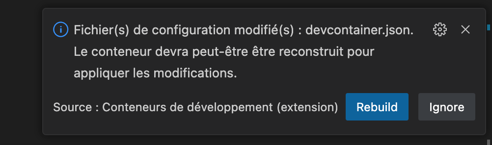

## Développer dans un conteneur

Avec l'extension **Dev Containers**, il est possible d'avoir son environnement de développement complet dans un conteneur Docker. Mais quel est l'intérêt? Cette approche a plusieurs avantages:

- **Rapidité d'installation**: pour travailler sur un nouveau projet, il suffit de cloner le dépôt et d'ouvrir le dossier dans VS Code. L'extension va alors télécharger l'image Docker et lancer le conteneur, qui contient tout ce dont vous avez besoin pour travailler sur le projet. Fini les longues installations d'outils et dépendances !
- **Reproductibilité**: l'environnement de développement peut être partagé avec vos collègues, pour être sûr que tout le monde travaille dans les mêmes conditions. Il peut également être versionné avec votre code, ce qui facilite les mise à jour.
- **Cloisonnement des projets**: chaque projet dispose de son propre environnement isolé, ce qui évite les conflits de version et permet de ne pas polluer votre système avec des dépendances de développement.

Pour l'utiliser, il faut d'abord installer Docker sur votre machine. Ensuite après avoir installé l'extension, vous pouvez configurer un nouvel environnement pour votre project en cliquant sur l'icône en bas à gauche puis en sélectionnant `Ajouter les fichiers de configuration du conteneur de développement...`. Vous pouvez ensuite choisir un environnement de base parmi les nombreux modèles proposés, ou bien créer votre propre configuration.


Une fois l'environnement créé, selectionnez `Rouvrir dans le conteneur` dans la fenêtre de notification qui s'affiche. Sinon, vous pouvez également cliquer sur l'icône en bas à gauche et selectionner cette option dans le menu. VS Code va recharger la fenêtre de votre projet et construire le conteneur, ce qui peut prendre quelques minutes au premier lancement. Par la suite, le chargement sera quasi-instantané. Une fois terminé, vous pourrez constater que VS Code est connecté à votre conteneur de dev via la barre de statut.


Vous pouvez maintenant ouvrir un terminal et utiliser votre nouvel environnement de dev ! Dans cet exemple, j’ai choisi un environnement Node.js. Notez que si maintenant tous mes outils de dev sont bien isolés dans le conteneur, le code source du projet ne s’y trouve pas : il reste stocké directement sur ma machine, et connecté au container via un volume. Il n’y a donc aucun risque de perdre ses données, même si le conteneur est détruit.

### Personnalisation de l'environnement

L'environnement de développement est défini dans le fichier `.devcontainer/devcontainer.json`. Ce fichier est généré lors de la création de l'environnement, mais vous pouvez le modifier pour personnaliser votre environnement. Par exemple, vous pouvez ajouter des extensions VS Code, installer des outils supplémentaires, ou encore définir des commandes à lancer automatique au démarrage du conteneur.

Par défaut, le conteneur utilise une image Docker pré-construite, mais vous pouvez également définir votre propre image personnalisée. Il suffit de créer un fichier `Dockerfile` dans le dossier `.devcontainer` et de remplacer la propriété `image` par:

```
"build": {
    "dockerfile": "Dockerfile"
}
```

Pour appliquer les modifications, vous pouvez reconstruire le conteneur en ouvrant la palette de commande puis en selectionnant `Conteneurs de Devéloppement: Reconstruire le Conteneur`.

Une fois la configuration du conteneur terminée, il ne vous reste plus qu’à pousser le répertoire `.devcontainer` dans votre dépôt de code, pour que toute votre équipe puisse en profiter. Si un de vos collègues met à jour la configuration, vous verrez alors cette notification:



Il suffira ensuite de selectionner `Rebuild` pour mettre à jour votre environnement de développement.

> **Bon à savoir**: il est possible d'utiliser les conteneurs de développement même avec des projets qui utilisent Docker directement. Dans ce cas il y a deux choix de fonctionnement possibles: avoir un nouvel environnement Docker isolé de celui de sa machine, ou au contraire appeler directement le Docker de la machine hôte depuis le conteneur de développement. Je vous invite à consulter le site https://containers.dev/features pour la liste des fonctionnalités activables.
