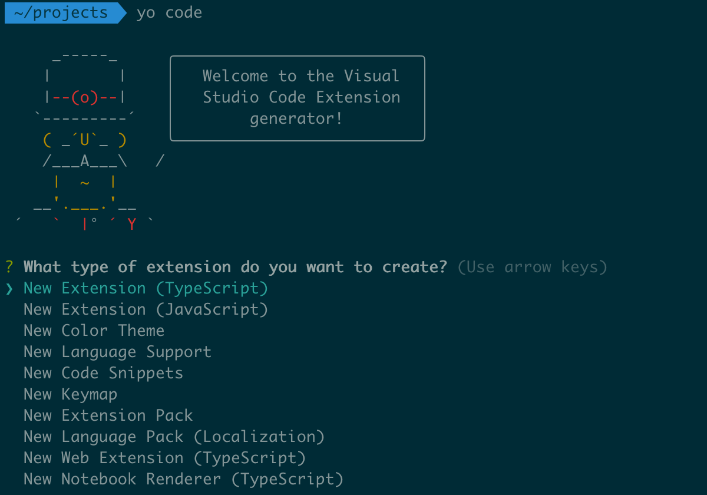

## Créez votre première extension

Maintenant que vous connaissez VS Code sur le bout des doigts, pour aller encore plus loin dans la personnalisation vous pouvez coder votre extension. Si une fonctionnalité vous manque, ou si vous souhaitez simplement en apprendre plus sur le fonctionnement interne de VS Code, il est possible de créer sa propre extension et la publier sur le marketplace pour en faire profiter tout le monde.

VS Code lui-même est codé en _TypeScript_, et utilise le framework Electron qui est basé sur _Node.js_ et Chromium. Vous avez ainsi besoin de Node.js pour développer votre extension. Après avoir installé Node.js sur votre machine, il vous faut ensuite installer le générateur d'extensions de VS Code:

```bash
npm install -g yo generator-code
```

Créez un nouveau projet d'extension en tapant `yo code` dans un terminal. Vous avez alors le choix de créer differents types d'extensions:



Pour cet exemple, on va créer une extension qui ajoute une commande à la palette de commande. Choisissez la première option, puis remplissez les champs demandés comme ci-dessous:


Ouvrez ensuite le projet généré dans VS Code, puis ouvrez le fichier `package.json`. Ce fichier contient les informations de votre extension, comme son nom, sa version, sa description, etc. C'est également ici que l'on définit ce que notre extension va ajouter à VS Code, via la propriété `contributes`. Dans notre cas, on va ajouter une commande pour effectuer directement une recherche sur le site Stack Overflow. Modifiez la propriété `contributes` existante comme ci-dessous:

```
"contributes": {
  "commands": [
    {
      "command": "vscode-overflow.search",
      "title": "Rechercher sur Stack Overflow"
    }
  ]
},
```

On a défini ici une nouvelle commande, qui sera accessible via la palette de commande. On va maintenant définir ce que cette commande va faire. Pour cela, ouvrez le fichier `src/extension.ts`. Ce fichier contient le code de votre extension. Vous pouvez voir que le code généré par le générateur d'extensions est déjà fonctionnel, et contient des commentaires pour aider à comprendre ce qu'il se passe ici. Nous allons maintenant ajouter notre code pour effectuer une recherche sur Stack Overflow. Remplacez ces lignes:

```typescript
let disposable = vscode.commands.registerCommand('vscode-overflow.helloWorld', () => {
  // The code you place here will be executed every time your command is executed
  // Display a message box to the user
  vscode.window.showInformationMessage('Hello World from vscode-overflow!');
});
```

Par le code suivant:

```typescript
let disposable = vscode.commands.registerCommand('vscode-overflow.search', async () => {
  // Récupère le texte sélectionné
  let query = vscode.window.activeTextEditor?.document.getText(vscode.window.activeTextEditor.selection);

  if (!query) {
    // Demande à l'utilisateur de saisir une question
    query = await vscode.window.showInputBox({
      placeHolder: 'question',
      prompt: 'Recherchez sur StackOverflow'
    });
  }

  const uri = vscode.Uri.parse(`https://stackoverflow.com/search?q=${query}`);

  // Ouvre le navigateur avec la recherche
  await vscode.commands.executeCommand('vscode.open', uri);
```

Maintenant, appuyez sur `F5` pour tester votre extension. Une nouvelle fenêtre de VS Code va s'ouvrir, avec votre extension installée. On peut maintenant la tester en ou ouvrant la palette de commande et en selectionnant `Rechercher sur Stack Overflow`, saisissez une question et appuyez sur `Entrée`. Une nouvelle fenêtre de navigateur va s'ouvrir avec les résultats de la recherche. Vous pouvez également sélectionner du texte dans l'editeur et lancer la commande, le texte sélectionné sera utilisé comme question.


> **Note**: Par mesure de sécurité, VS Code vous demande de confirmer l'ouverture lorsqu'il ne reconnait pas le domaine d'un site web, comme c'est le cas ici. Vous pouvez désactiver cette demande de confirmation en ajoutant le domaine à la liste des sites de confiance en choisissant l'option `Configurer les domaines approuvé` dans la fenêtre de confirmation.

Bravo, vous avez créé votre première extension pour VS Code! Bien sûr, il est possible de faire beaucoup plus avec les extensions, comme ajouter des menus, des barres d'outils, des snippets, etc. Vous pouvez retrouver la documentation complète ainsi que des guides et exemples à l'adresse https://code.visualstudio.com/api.
